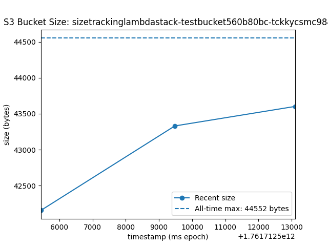

# project structure

We’ll use these four stacks:
1. StorageStack: DynamoDB table (+ GSI). No bucket here.
2. SizeTrackingLambdaStack: S3 bucket + SizeTracking lambda + S3 notifications.
3. PlotLambdaStack: Plot lambda + API Gateway (reads Dynamo and writes PNG to the bucket).
4. DriverLambdaStack: Driver lambda (needs bucket RW + the Plot API URL).

This way:
SizeTrackingLambdaStack depends on StorageStack (for the table).
StorageStack does not reference the lambda stack (no S3 notifications there), so no back edge.
PlotLambdaStack depends on both StorageStack (table) and SizeTrackingLambdaStack (bucket).
DriverLambdaStack depends on PlotLambdaStack (API URL) and SizeTrackingLambdaStack (bucket).

Here you go — a clean, copy-paste **README.md** that explains the architecture, stacks, deploy flow, and how to verify using what you saw in your `cdk diff` output.

---

# S3 Bucket Size Microservices (CDK)

Track and plot an S3 bucket’s total size over time using a microservice architecture with three Lambdas:

* **SizeTrackingLambda** (triggered by S3 events)
* **PlotLambda** (queried through API Gateway)
* **DriverLambda** (creates/updates/deletes test objects, then calls Plot API)

This repo is fully provisioned by **AWS CDK v2** and split into logical stacks to avoid circular dependencies and keep concerns separate.

---

## 📐 Architecture

```
          ┌─────────────────────────┐
          │  StorageStack           │
          │  (DynamoDB + GSI)       │
          │  Table: S3-object-size… │
          └──────────┬──────────────┘
                     │ (Query/Write)
                     │
     ┌───────────────▼──────────────────┐
     │ SizeTrackingLambdaStack          │
     │  • S3 Bucket (TestBucket)        │
     │  • SizeTrackingLambda            │
     │  • S3→Lambda Notifications       │
     └───────────┬──────────────────────┘
                 │ (Put plot, read/write objects)
                 │
        ┌────────▼──────────┐            ┌──────────────────────┐
        │ PlotLambdaStack    │            │ DriverLambdaStack    │
        │  • PlotLambda      │            │  • DriverLambda      │
        │  • API Gateway     │◄──────────▶│  calls Plot API      │
        └────────────────────┘            └──────────────────────┘
```

* **No cycles:** S3 bucket and its notifications live in the **same** stack as SizeTrackingLambda. DynamoDB is in **StorageStack**. Plot/Driver consume exported outputs.

---

## 🧱 Stacks

### 1) `StorageStack`

DynamoDB table (PK=`bucket`, SK=`ts`) + **GSI** `(bucket, size_bytes)` for O(1) “all-time max” queries.

* **From your `cdk diff`:**

  * `AWS::DynamoDB::Table SizeHistoryTable`
  * Outputs: `TableName`, `GsiName`, and exported ARNs for cross-stack grants

### 2) `SizeTrackingLambdaStack`

Owns the **S3 bucket**, **SizeTrackingLambda**, and the **S3 → Lambda event notifications**.

* **From your `cdk diff`:**

  * `AWS::S3::Bucket TestBucket`
  * Custom resources for auto-delete in dev (clean teardown)
  * Permissions: S3 invokes the Lambda (`lambda:InvokeFunction` with `AWS:SourceArn` = bucket)
  * Grants: Lambda can list/get on bucket; read/write on DynamoDB (imported from `StorageStack`)

### 3) `PlotLambdaStack`

**PlotLambda** + **API Gateway** to invoke it synchronously.
Reads last N seconds from table, queries **max** via GSI, plots PNG, and **PUTs** to S3.

* **From your `cdk diff`:**

  * `AWS::Lambda::Function PlotLambda`, optional `AWS::Lambda::LayerVersion MatplotlibLayer`
  * `AWS::ApiGateway::RestApi PlotApi` + Stage `dev`
  * Permissions on:

    * Table (read/query incl. `…/index/*`)
    * Bucket (get/put object + list bucket)
  * Output: `PlotApiUrl` (Invoke URL ending with `/dev/`)

### 4) `DriverLambdaStack`

**DriverLambda**: creates/updates/deletes test objects with sleeps in between → fires SizeTrackingLambda; then **calls Plot API**.

* **From your `cdk diff`:**

  * `AWS::Lambda::Function DriverLambda`
  * Permissions: RW on bucket (imported from `SizeTrackingLambdaStack`)

---

## 🗂 Repository Structure

```
s3-size-micro/
├─ bin/
│  └─ app.ts                         # instantiates the four stacks
├─ lib/
│  ├─ storage-stack.ts               # DynamoDB + GSI
│  ├─ size-tracking-lambda-stack.ts  # Bucket + SizeTracking + Notifications
│  ├─ plot-lambda-stack.ts           # PlotLambda + API Gateway
│  └─ driver-lambda-stack.ts         # DriverLambda
├─ lambdas/
│  ├─ lambda_driver.py
│  ├─ lambda_plotting.py
│  └─ lambda_size_tracking.py
├─ layers/
│  └─ matplotlib-py313-x86-layer.zip # optional (matplotlib/numpy/pillow)
├─ package.json
├─ tsconfig.json
└─ cdk.json
```

---

## ⚙️ Environment & Versions

* **Runtime:** Python 3.13 (adjust to 3.12 if your wheels/layer target that)
* **CDK:** v2 (TypeScript, CommonJS)
* **Region:** defaults to `us-east-1` in `bin/app.ts` (overridden by `CDK_DEFAULT_REGION`)

> The CLI may warn that Node 18 support is ending — upgrading to Node 20+ is recommended.

---

## 🚀 Deploy

```bash
# install deps / compile TS
npm install
npm run build

# bootstrap once per account/region (if not done yet)
npx cdk bootstrap aws://YOUR_ACCOUNT_ID/us-east-1

# see stacks CDK will deploy
npx cdk ls
# StorageStack
# SizeTrackingLambdaStack
# PlotLambdaStack
# DriverLambdaStack

# sanity check the template changes
npx cdk synth
npx cdk diff

# deploy everything
npx cdk deploy --all
```

---

## ✅ Verify

1. **Confirm resources created**

   * DynamoDB table & GSI (StorageStack outputs show names)
   * S3 bucket (SizeTrackingLambdaStack output `BucketName`)
   * Plot API (PlotLambdaStack output `PlotApiUrl`)
   * Lambdas present in their stacks

2. **Run the flow**

   * In Lambda Console → **invoke `DriverLambda`**
   * Watch CloudWatch Logs for `SizeTrackingLambda` and `DriverLambda`
   * Check DynamoDB table rows (new items appear with `bucket`, `ts`, `size_bytes`, `object_count`)
   * Open `s3://<bucket>/plots/plot.png`
   * Or hit `GET <PlotApiUrl>?window=10` to regenerate/return a presigned URL (depending on your code)

---

## 🔐 Permissions (what you saw in `cdk diff`)

* **S3 → SizeTrackingLambda:**
  `lambda:InvokeFunction` allowed for `Service: s3.amazonaws.com` with conditions:

  * `AWS:SourceArn` = bucket ARN
  * `AWS:SourceAccount` = your account

* **PlotLambda & DriverLambda → Bucket:**
  get/list/put/delete object permissions on `bucketArn/*` (and some bucket-level ops on `bucketArn`)

* **SizeTrackingLambda → DynamoDB:**
  read/write data (PutItem for snapshots)

* **PlotLambda → DynamoDB:**
  read/query on table **and** `…/index/*` for the GSI

---

## Sample plot output



## 🧰 Notes & Tips

* **Why this split avoids cycles:**
  S3 bucket and its notifications live in **SizeTrackingLambdaStack**, so the bucket’s notification (which needs the Lambda ARN) doesn’t force `StorageStack` to depend on Lambda. Other stacks import the bucket/table via **exports** only in a single direction.

* **Matplotlib layer (optional):**
  If your plotting Lambda imports `matplotlib`/`numpy`/`Pillow`, include a layer ZIP under `layers/` with a top-level `python/` directory. Set `attachMatplotlibLayer: true` in `plot-lambda-stack.ts`. If not needed, set it to `false`.

* **Dev convenience:**
  Bucket has `autoDeleteObjects: true` and `RemovalPolicy.DESTROY` to make `cdk destroy` easy. Change to **retain** in prod.

---

## 🧹 Cleanup

```bash
# remove all stacks & resources (thanks to DESTROY settings)
npx cdk destroy --all
```

---

## 🐛 Troubleshooting

* **Only default stack deploys:**
  Ensure `bin/app.ts` is instantiating **these** four stacks. Run `npx cdk ls` to confirm.

* **Cyclic dependency error:**
  Confirm bucket + S3 notifications are in **SizeTrackingLambdaStack** (not `StorageStack`). Don’t add manual `addDependency` that creates a back edge.

* **Lookup role warning:**
  `Lookup role ... was not assumed` — CDK will proceed with your default credentials. You can safely ignore or configure context lookups/roles if needed.

